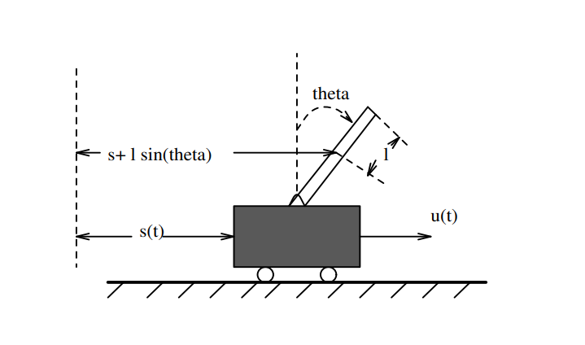

# GLCP
Simple repo demoing LGR and LQG for a cartpole system

Repo shows basic linear control with a LQR, Kalman Filter, and LQG implementation for a cartpole system.

Noteable features include:
- Riccati equation solver using eigen value decomposition method
- Fixed and adaptive step explicit integration with RK54, RK65 (Verner), and RK87 (Verner) methods
- Use of Eigen for matricies and linear algebra
- Cartpole system class, ability to add/remove different LQR controllers or Kalman observers

The cartpole_demo.cpp shows a basic linear trajectory problem: 

Move the cart from [-1., 0., 0., 0.] to [10., 0.0 , 0.0, 0.0]

    

The demo executable shows how to define the weighting Q & R matricies for your LQR controller and how to specify disturbance and noise covariances.

Results of the non-noisy system

    

Results of the noisy system. Note that in the displayed demo the estimate of x0 was purposly chose to have a 0.1 displacement on theta 

    

Note that this is not a complete program, noteable upgrades include:
- Creating and using GLCP namespace
- Discrete time formulation
- Applying the control inputs in the non-linear equations of motion when use_linear = false
    - Currently the rates are calculated non-linearly xdot = f(x,u), and u set to zero, but then control is applied linearly xdot += -B * K * x. Instead of u = - K * x -> xdot = f(x,u)
- Functionizing the integration templates to make them more modular
- Creating a base System class that CartpoleSystem inhierets from, add/disable LQR and Kalman Filter can be base methods
- Adding const to all functions/methods that can be const. I only really checked the variable arguments.  